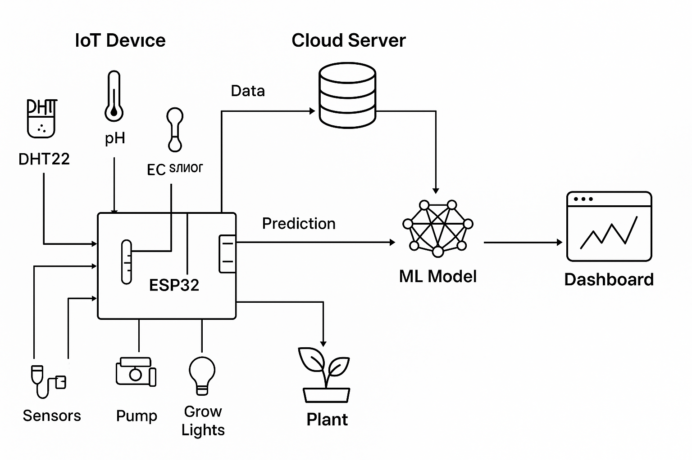

# 🌱 Smart Hydroponics System with AI-Driven Plant Health Monitoring

[](LICENSE)
[](https://www.espressif.com/)
[](https://www.tensorflow.org/)
[](https://nextjs.org/)

An **IoT-enabled hydroponics system** that automates plant care and uses **machine learning** to predict plant health from leaf images.

---

## 📚 Table of Contents

* [Overview](#overview)
* [Features](#features)
* [System Architecture](#system-architecture)
* [Hardware Setup](#hardware-setup)
* [Software Stack](#software-stack)
* [Quick Start](#quick-start)
* [Machine Learning Workflow](#machine-learning-workflow)
* [Project Roadmap](#project-roadmap)
* [Screenshots](#screenshots)
* [Contributing](#contributing)
* [License](#license)

---

## ✅ Overview

This project combines **embedded systems**, **IoT**, and **AI** to create an intelligent hydroponics system capable of:

* Monitoring environmental factors (pH, EC, temperature, humidity, light).
* Automating nutrient dosing, lighting, and water cycles.
* Detecting plant health issues (deficiencies, diseases) using **computer vision**.
* Providing real-time control and analytics via a **web dashboard**.

---

## ✨ Features

✔ Automated nutrient & water management
✔ Real-time sensor data monitoring via dashboard
✔ AI-based plant health detection (healthy vs deficient)
✔ Cloud integration for remote control & logging
✔ Edge inference with **TinyML** or cloud-based predictions

---

## 🖼 System Architecture



**Data Flow:**

1. ESP32 reads sensors & controls actuators.
2. Captured leaf images sent to the ML model (cloud or edge).
3. Predictions displayed on the dashboard along with real-time stats.

---

## 🛠 Hardware Setup

| Component            | Quantity | Specs                   |
| -------------------- | -------- | ----------------------- |
| **ESP32-CAM**        | 1        | Wi-Fi + Camera Module   |
| **DHT22 Sensor**     | 1        | Temp & Humidity         |
| **pH Sensor**        | 1        | 0-14 pH range           |
| **EC Sensor**        | 1        | Electrical conductivity |
| **Water Pump**       | 1        | 12V submersible         |
| **Peristaltic Pump** | 2        | For pH and nutrients    |
| **Grow Lights**      | 1 set    | Full-spectrum LED       |

👉 **Full BOM:** [docs/hardware.md](docs/hardware.md)
👉 **Wiring Diagram:** [docs/images/wiring-diagram.png](docs/images/wiring-diagram.png)

---

## 🖥 Software Stack

* **Firmware:** ESP32 (Arduino / PlatformIO)
* **Communication:** MQTT, HTTP
* **ML Model:** TensorFlow → TensorFlow Lite (for edge)
* **Backend:** Flask / FastAPI + PostgreSQL
* **Dashboard:** Next.js + TailwindCSS

---

## 🚀 Quick Start

### **1. Flash Firmware**

```bash
cd firmware
platformio run --target upload
```

### **2. Start Backend**

```bash
cd cloud-backend
pip install -r requirements.txt
python app.py
```

### **3. Run Dashboard**

```bash
cd dashboard
npm install
npm run dev
```

---

## 🤖 Machine Learning Workflow

1. **Collect Images**: Captured by ESP32-CAM → Uploaded to cloud.
2. **Label Data**: Classes like `Healthy`, `Nitrogen Deficiency`, `Pest Damage`.
3. **Train Model**: MobileNetV2 / EfficientNet for classification.
4. **Deploy Model**:

   * Cloud inference via API.
   * Edge inference using **TensorFlow Lite** for ESP32.

👉 Detailed ML steps: [docs/ml-workflow.md](docs/ml-workflow.md)

---

## 🗺 Project Roadmap

* ✅ **Phase 1**: Sensor integration & MQTT communication
* ✅ **Phase 2**: Pump & light automation
* ✅ **Phase 3**: Image capture & upload
* ✅ **Phase 4**: Train ML model for plant health detection
* ✅ **Phase 5**: Cloud API & dashboard integration
* 🔜 **Phase 6**: Edge AI deployment

---

## 🖼 Screenshots

*(Add later after UI development)*

* Dashboard with live sensor data
* Plant health prediction page

---

## 🤝 Contributing

We welcome contributions! Please read [CONTRIBUTING.md](CONTRIBUTING.md) for details.

---

## 📜 License

This project is licensed under the **MIT License** – see [LICENSE](LICENSE) for details.

---

---

### ✅ Next Step:

I can now **generate `docs/hardware.md`** with:

* Complete **Bill of Materials** (with links for purchase)
* **Wiring diagram** for ESP32 + sensors + pumps + camera
* Power distribution details

Do you want me to proceed with **hardware.md including wiring diagram**? Or **start with ML workflow documentation**?
